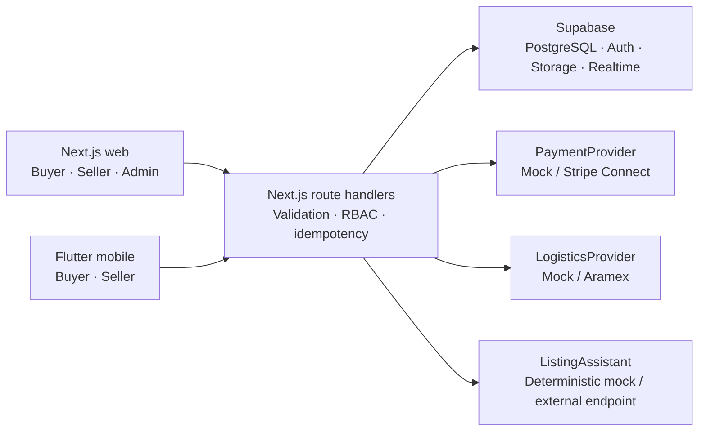
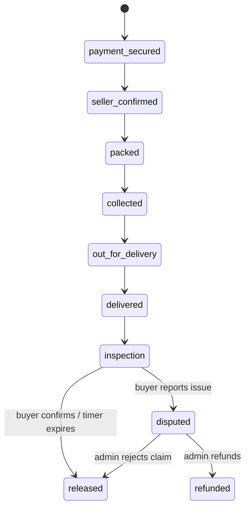

# PartsLoop architecture

PartsLoop is a local-first monorepo. The root Next.js application serves the
buyer marketplace plus role-separated seller and admin portals. The Flutter
application lives in `apps/mobile`, while reusable domain contracts live in
`packages/contracts`.

## Trust boundaries

- Browser and mobile input is always untrusted and validated at the API edge.
- A service-role key is server-only. The browser uses the Supabase anonymous
  key and row-level security.
- Payment and logistics webhooks are idempotent and should be persisted by
  provider event ID before applying order transitions.
- “Escrow” is presented as protected payment. Funds are authorized or held by a
  licensed payment provider; PartsLoop does not operate an unlicensed wallet.
- AI output is a draft. A seller must confirm fitment, condition, and defects.

## Protected order state machine

Only the server applies these transitions. Client buttons request a transition;
they never write order status directly.
